# My Project
## weekly report

### until 3/19 (~2 weeks from being set on the genral direction of the project)
These two weeks were research focused. I really wanted to make a generalized 3d tesselation builder. My vision was to be able to generalize every coxeter group to a 3d tesselation enviroment where you can build/destroy polehedra. The problem was that I had no idea how to remotely do something of the sort, with no comprehensive guides online except for a few advanced papers who used all sorts of advanced geometric group theory terminology which I didn't understand.

I said to myself that if I really want to understand what I'm doing I need to start from the basics. In the first week of the project I binged the book "The Geometry of Things", but even though the book was exactly what I needed, after 200 pages I still didn't have a clue how to do it. I didn't want to support any kaldiescopic tiling, just uniform honeycombs of a euclidian field.

I stumbled upon the Wythoff Construction Method which is a easy representation and construction method of a subgroup of the generalized Coxeter group tilings. However, the method creates 3 (generously 5) diferent uniform tiling types, and in my opinion with so little generalization it is preferable to hardcode the different tiling groups. Moreover, all these construction methods are ways to create the base polyehedron(s), but still leave me open to how caluculate the voxel positions and how to store them at all, let alone how to do efficiantly.

After much headache I thought that the direction the project is heading is too reeasrchy and misses the point of this lab. I decided that instead of trying to generalize every 3d euclidian tesselation, I want to focus on the practical elements - chunk management, block types, building and destroying blocks (which involoves ray casting) etc. So I decided to make a hexagon prism voxel engine. However, as soon as i found a project in Shader Toy which does more or less exactly what I want to do, I decided to be a bit more ambitious. So I finally settled on my final project idea:

I want to create a hexagonaical planet voxel engine. What does that mean? I plan on making an interactive spherical enviroment made out of hex prisms (kind of).
The planet will be shaped like a geodical dome made out of hexagons.

The first problem I encountered is that there is no such object. you cant tile a sphere with hexagons, that is due to euler charitaristic. That means that we will have to have a couple of pentagons as well. The tiling will be by projecting an icosahedron to a spherical plance. Where each face will represent a chunck which will have a 3d hexaprism coordinate system. 

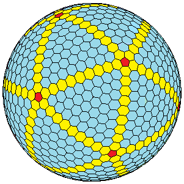

Then I thought to reasearch hexagon coordinate systems. I will most likely use the axial representation even though that if I want to fill up an entire 2d array, the chunck will be need to be comprimised of two face of the icosahedron, leaving us with 10 chucks.


**Total Time** ~20 hours (that led nowhere)
### 25/3 
Started the implementation this week. Most of the week went away to bashing my head with CMAKE, the general program flow is similar to the Computer Graphics Course assignments. Then I started implementing the openGL framework. It took so much more time than I'd like to admit until there was a visible triangle on screen. Then I built the basic program chunck layout. Each chunck is a face of the rendered icosahedron. 

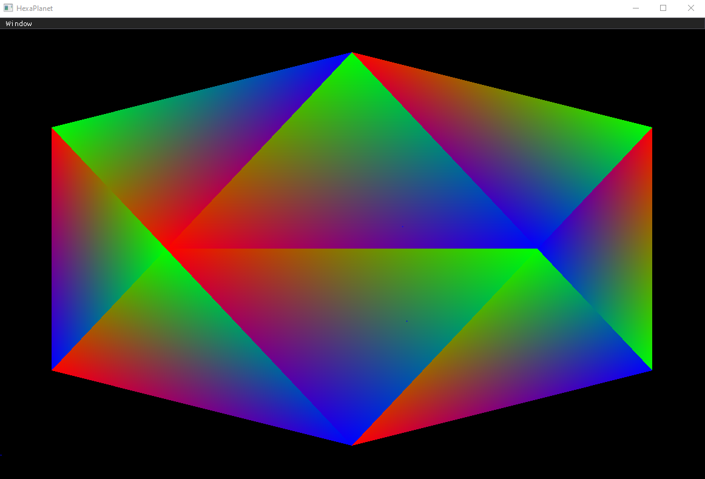

Finally I added basic ImGui functionality. 

**Total Time** ~10 hours

### 3/4
First I worked on a basic camera setup. Next I implemented the voxel grid. This went through a lot of iterations, I decided to ditch the original plan of storing two adjacent chunk with one grid (which I'll call root chunk) because the code was prone to many edge cases. That's why I decided that each root chunk will be comprised of 4 chunks! Here is a demonstration of the root chunks - each root chunk is a different color.


Due to this new requirement I needed to reimplement the icosahedron because previously it was all over the place.
Why represent this way?
Here is a cardboard cutout of an isocahedron:
```
    / \   / \   / \   / \   / \
   /   \ /   \ /   \ /   \ /   \
  --------------- ----- ---------
   \   / \   / \   / \   / \   / \
    \ /   \ /   \ /   \ /   \ /   \
     - - ----- ---- ---- ---- ---- - 
      \   / \   / \   / \   / \   /
       \ /   \ /   \ /   \ /   \ /
```
In this representation, each vertical strip is a root chunk. And therefor all root chunks are symetrical.

Most of the time this week went to the hexagon convertion. My idea is to do the following - too render a voxel, first I translate the grid index to a 2d coordinate system shaped like the centers of a hexahedron grid system. Then based on the index of the chunk within the root chunk, I find the barycentric coords of the relevent triangle within the root chunk. Then I perform **double slerp** to find the projection of the point on a sphere. As for the height, that is a seperate system that indepedently calculates the height (more to work on later). 

This roughly is the algorithm to find the center of the hexaprism. However, finding the hexaprisms vertices is no easy feet. The voxel isn't a perfect prism - the top hexagon slightly larger that the bottom.
In order to find the vertices, I use the fact that the hexagon is the face dual of a triangle, so the vertices are the average between the centers of its neighbors.

So the theory is kind of under control, however does it work?

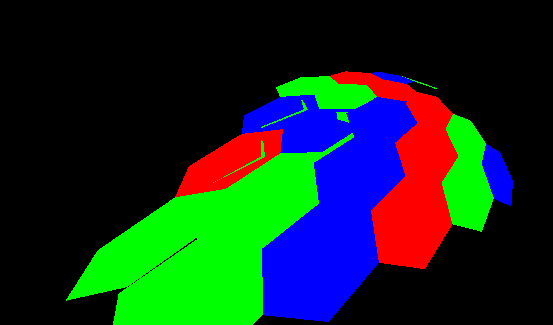
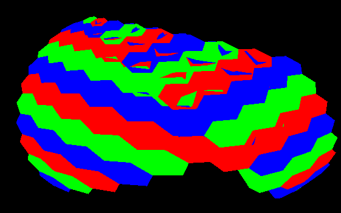
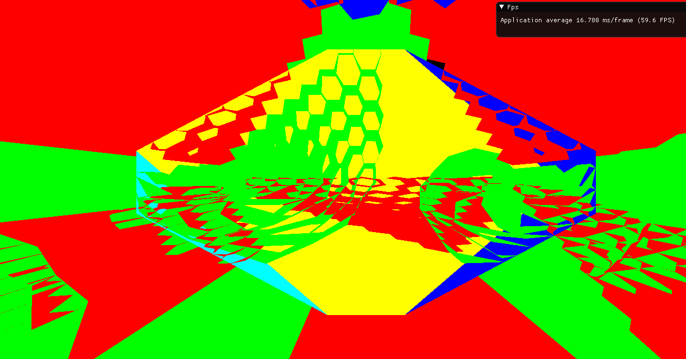
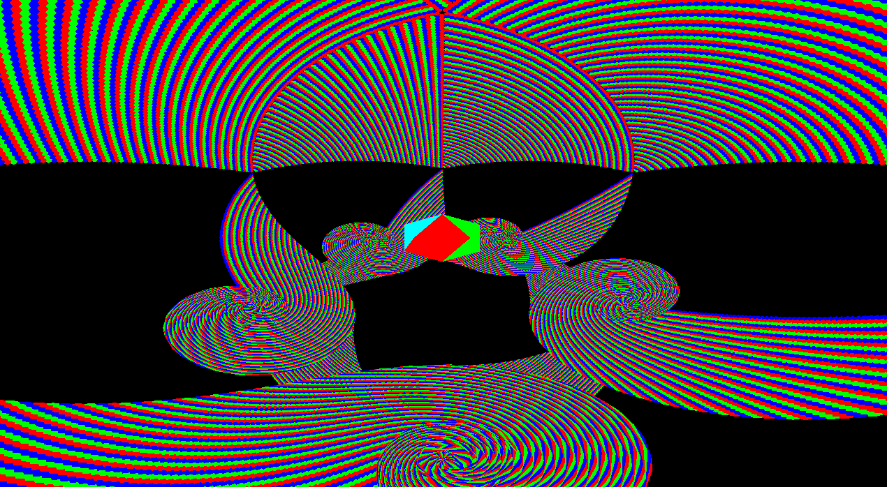

Short Answer: not yet ;)
let's leave something to do next week!!

**Total Time** ~12 hours

### 9/4

This week was intensive. The code went through two major overhauls. Due to the glitchy mess of last week, I decided I need to understand whats going on there and not just mindlessly changing parameters until it works. So I started working on the neighbor coordinate system and found out that the inner chunk neighbors make no sense so I updated the chunk representation system (yes again) and now I (kind of) understand whats gong on. After that things started to look correct. However I couldn't get rid of the inaccuracies between the boundaries of two root chunks: 

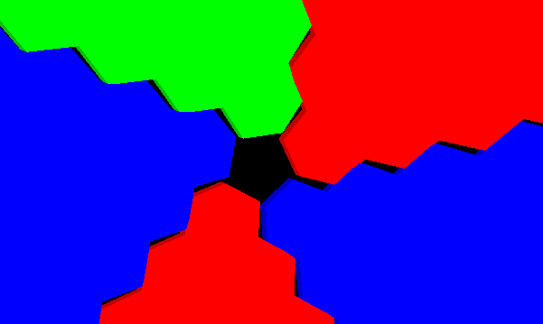

No matter how much I tried nothing worked. Being frustrated I decided to be productive and quickly implemented a camera movement system, which will help me debugging. The inaccuracy is an inherent bug of the current implemetation - each chunk is being caclulated relative to the baricentric coordinates of the appropriate isocahedron face, and then is projected onto a sphere and thats the cause of the inaccuracies because the chunks have a slightly different coordinate system due to the different slopes of an icosahedron in space. 

Thats were major overhaul no.2 comes into play - First I needed to finalize the neighbor system. That's because the new way of creating the hexagon vertices is to take the average of the neighbors (even when the neigbors are cross chunks, or even worse, cross root chunks), in this way, adjacent hexagons agree on the same borders, even if they are located on different chunks. Here is what it looks like now:

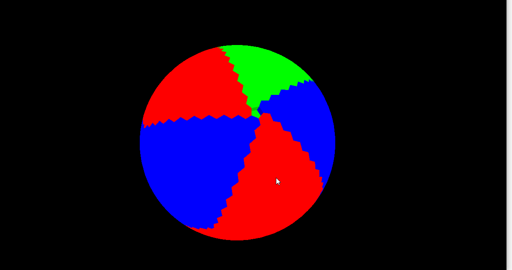

Yay!! Finally something that looks correct. Turning the hexagons into a prism is not hard at all. Now every hexaprism is comprised of 20 faces - 4 for the top, 4 for the bottom, and 2 for each side. Here is a demonstration of the system: 

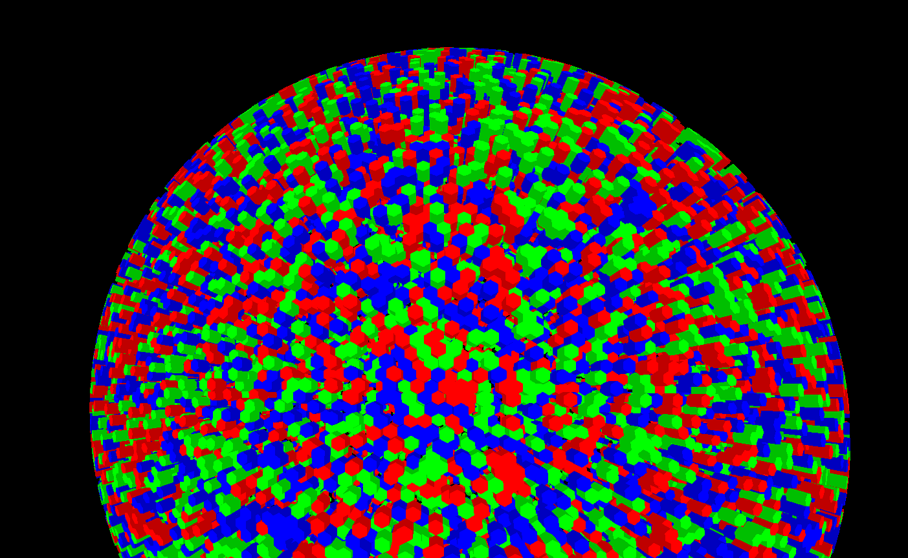

One thing I didn't metion is that I implemented simple ambient occlusion - i.e. I darken the sides of the prisms to create the effect of shading. 
**Total Time** ~20 hours

### Next Week 
Turns out the system falters with a small size (I want it to support any size - even a simple decoahdron). Here is what it looks like:

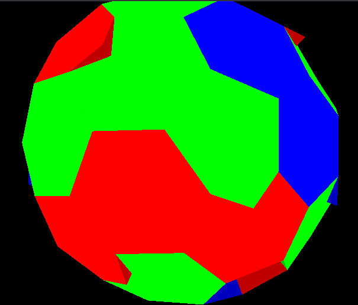

The reason for this is because I thought I could get away with only to hexagons - one at the top and at the bottom. However that is not the case. There should be 12 hexagons - It is obvious when I delete the bad voxels in the previous example:

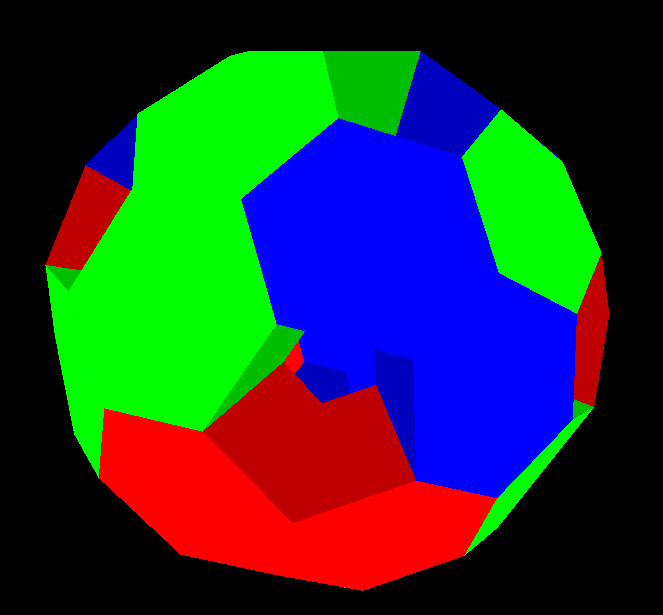


