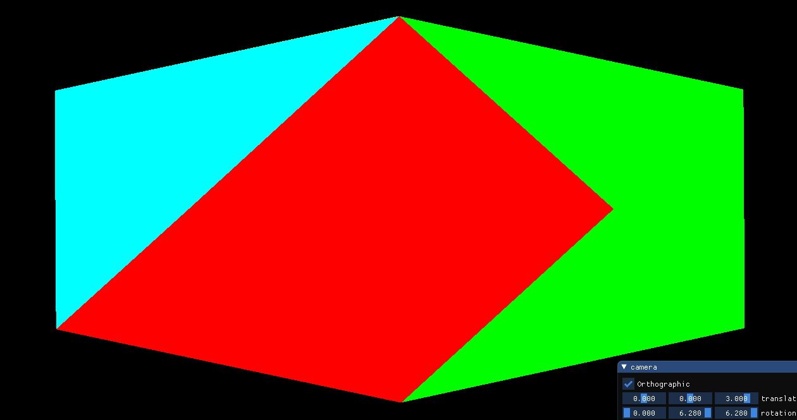
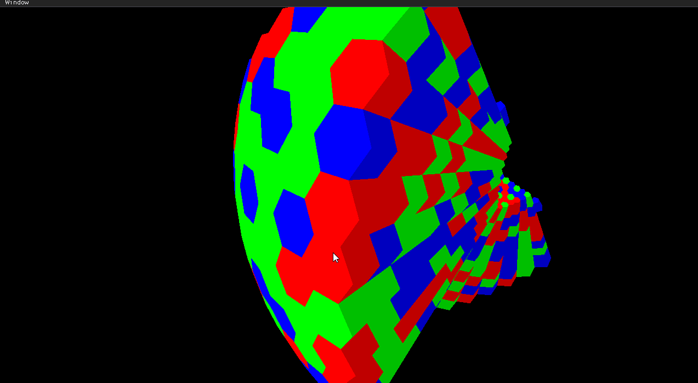
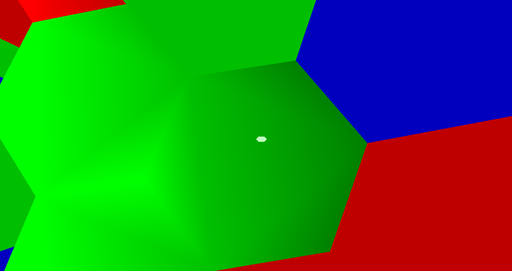

# My Project
## weekly report

## until 3/19 (~2 weeks from being set on the genral direction of the project)
These two weeks were research focused. I really wanted to make a generalized 3d tesselation builder. My vision was to be able to generalize every coxeter group to a 3d tesselation enviroment where you can build/destroy polehedra. The problem was that I had no idea how to remotely do something of the sort, with no comprehensive guides online except for a few advanced papers who used all sorts of advanced geometric group theory terminology which I didn't understand.

I said to myself that if I really want to understand what I'm doing I need to start from the basics. In the first week of the project I binged the book "The Geometry of Things", but even though the book was exactly what I needed, after 200 pages I still didn't have a clue how to do it. I didn't want to support any kaldiescopic tiling, just uniform honeycombs of a euclidian field.

I stumbled upon the Wythoff Construction Method which is a easy representation and construction method of a subgroup of the generalized Coxeter group tilings. However, the method creates 3 (generously 5) diferent uniform tiling types, and in my opinion with so little generalization it is preferable to hardcode the different tiling groups. Moreover, all these construction methods are ways to create the base polyehedron(s), but still leave me open to how caluculate the voxel positions and how to store them at all, let alone how to do efficiantly.

After much headache I thought that the direction the project is heading is too reeasrchy and misses the point of this lab. I decided that instead of trying to generalize every 3d euclidian tesselation, I want to focus on the practical elements - chunk management, block types, building and destroying blocks (which involoves ray casting) etc. So I decided to make a hexagon prism voxel engine. However, as soon as i found a project in Shader Toy which does more or less exactly what I want to do, I decided to be a bit more ambitious. So I finally settled on my final project idea:

I want to create a hexagonaical planet voxel engine. What does that mean? I plan on making an interactive spherical enviroment made out of hex prisms (kind of).
The planet will be shaped like a geodical dome made out of hexagons.

The first problem I encountered is that there is no such object. you cant tile a sphere with hexagons, that is due to euler charitaristic. That means that we will have to have a couple of pentagons as well. The tiling will be by projecting an icosahedron to a spherical plance. Where each face will represent a chunck which will have a 3d hexaprism coordinate system. 


Then I thought to reasearch hexagon coordinate systems. I will most likely use the axial representation even though that if I want to fill up an entire 2d array, the chunck will be need to be comprimised of two face of the icosahedron, leaving us with 10 chucks.


**Total Time** ~20 hours (that led nowhere)
## 25/3 
Started the implementation this week. Most of the week went away to bashing my head with CMAKE, the general program flow is similar to the Computer Graphics Course assignments. Then I started implementing the openGL framework. It took so much more time than I'd like to admit until there was a visible triangle on screen. Then I built the basic program chunck layout. Each chunck is a face of the rendered icosahedron. 


Finally I added basic ImGui functionality. 

**Total Time** ~10 hours

## 3/4
First I worked on a basic camera setup. Next I implemented the voxel grid. This went through a lot of iterations, I decided to ditch the original plan of storing two adjacent chunk with one grid (which I'll call root chunk) because the code was prone to many edge cases. That's why I decided that each root chunk will be comprised of 4 chunks! Here is a demonstration of the root chunks - each root chunk is a different color.



Due to this new requirement I needed to reimplement the icosahedron because previously it was all over the place.
Why represent this way?
Here is a cardboard cutout of an isocahedron:
```
    / \   / \   / \   / \   / \
   /   \ /   \ /   \ /   \ /   \
  --------------- ----- ---------
   \   / \   / \   / \   / \   / \
    \ /   \ /   \ /   \ /   \ /   \
     - - ----- ---- ---- ---- ---- - 
      \   / \   / \   / \   / \   /
       \ /   \ /   \ /   \ /   \ /
```
In this representation, each vertical strip is a root chunk. And therefor all root chunks are symetrical.

Most of the time this week went to the hexagon convertion. My idea is to do the following - too render a voxel, first I translate the grid index to a 2d coordinate system shaped like the centers of a hexahedron grid system. Then based on the index of the chunk within the root chunk, I find the barycentric coords of the relevent triangle within the root chunk. Then I perform **double slerp** to find the projection of the point on a sphere. As for the height, that is a seperate system that indepedently calculates the height (more to work on later). 

This roughly is the algorithm to find the center of the hexaprism. However, finding the hexaprisms vertices is no easy feet. The voxel isn't a perfect prism - the top hexagon slightly larger that the bottom.
In order to find the vertices, I use the fact that the hexagon is the face dual of a triangle, so the vertices are the average between the centers of its neighbors.

So the theory is kind of under control, however does it work?


Short Answer: not yet ;)
let's leave something to do next week!!

**Total Time** ~12 hours

## 9/4

This week was intensive. The code went through two major overhauls. Due to the glitchy mess of last week, I decided I need to understand whats going on there and not just mindlessly changing parameters until it works. So I started working on the neighbor coordinate system and found out that the inner chunk neighbors make no sense so I updated the chunk representation system (yes again) and now I (kind of) understand whats gong on. After that things started to look correct. However I couldn't get rid of the inaccuracies between the boundaries of two root chunks: 


No matter how much I tried nothing worked. Being frustrated I decided to be productive and quickly implemented a camera movement system, which will help me debugging. The inaccuracy is an inherent bug of the current implemetation - each chunk is being caclulated relative to the baricentric coordinates of the appropriate isocahedron face, and then is projected onto a sphere and thats the cause of the inaccuracies because the chunks have a slightly different coordinate system due to the different slopes of an icosahedron in space. 

Thats where major overhaul no.2 comes into play - First I needed to finalize the neighbor system. That's because the new way of creating the hexagon vertices is to take the average of the neighbors (even when the neigbors are cross chunks, or even worse, cross root chunks), in this way, adjacent hexagons agree on the same borders, even if they are located on different chunks. Here is what it looks like now:


Yay!! Finally something that looks correct. Turning the hexagons into a prism is not hard at all. Now every hexaprism is comprised of 20 faces - 4 for the top, 4 for the bottom, and 2 for each side. Here is a demonstration of the system: 


One thing I didn't metion is that I implemented simple ambient occlusion - i.e. I darken the sides of the prisms to create the effect of shading. 

**Total Time** ~20 hours

## 16/4 
Turns out the system falters with a small size (I want it to support any size - even a simple decoahdron). Here is what it looks like:


The reason for this is because I thought I could get away with only two pentagons - one at the top and at the bottom. However that is not the case. There should be 12 pentagons - It is obvious when I delete the bad voxels in the previous example:


So next I implemented the pentaprism system which was a big headache but I'm glad its done. Each pentaprism is comprised of 16 faces - 3 for the top, 3 for the bottom, and 2 for each side. Here is what the previous image looks like with the pentagon voxels:


Something I didn't expect at all is that now we can display an even simpler primitive - A dodecahedron!


This just demonstrates the strength and generality of the implentation

Additionaly, I optimized the rendering code in a few places (for example previously I have done 2 calucaulations for every prism - one for the bottom and one for the top, but the calculation are almost identitcal and can be combined) and now it can render huge scenes as follows: 


There are still optimizations to be done, until next time ;)

**Total Time** ~5 hours

### 16/4 - start of May

I barely worked on the project the two weeks. Mainly due to the massive assighnments in Geometry Processing... I fely my head was gonna explode from too much computer graphics.

**Total Time** ~2 hours


### 7/5

After talking with Roi, we agreed that the most awesome thing to do next is to implement walking on the planet... Yes another minecraft clone! (but better if I do say so myself).

Little did I know what I was getting myself up to. I started by implementing the camera so that it supports a walk on a spherical geometry. This was way more complicated than I anticipated... I wanted the camera to turn along the planet (so that the angle between the camera and the sphere tangent will be consistent when moving the player while keeping the pitch and yaw the same), like the popular game Animal Crossing. I broke my head over this for hours, mainly because I looked for a simple solution when there isn't one. What happened was that the camera followed the geodesical circle around the pole of the sphere, resulting that moving straight didn't create a diameter around the sphere but a circle around the pole, spiriling inwards slowly.

Clueless as to what to do (searching the interwebs just increased my anxiety, all results leading towards hyperbolic projection), I decided to do some other stuff.

**Total Time** ~10 hours


## 14/5

This week I did other stuff, mainly just polishing and gui customability. 

The most notable thing that I implemented was a long awaited optimization: Currently when going through a dense world we recieve something like this:


What you see above is the ineffiecieccy where we render a face of a voxel even if it is covered, resulting in many un-needed polygons. The fix was relatively easy and now we ommit these faces:



Now we render the bare minimum needed (assuming the player isn't inside the terrain). 
The main difficulty was to ommit the faces in-between chunks. (I know it is minor but I'm pedantic ;)

**Total Time** ~4 hours


## 21/5

This week I was determined to fix the camera. I realized that the way I was trying to implement it was just impossible - I thought that given the player's position (and the planet's center of mass), the camera's yaw and pitch, there is this majic formula that spits out the camera rotation in the world. This however isn't true, we must save some other data about the player's last position, otherwise it is enevitable to be sucked to the poles.

I do something similar, instead of saving the player's last position, I maintain a variable that keeps the camera's relative north pole of the sphere. It is set to be on the side of the sphere relative to where the camera is (now I know that there are many options for the n. pole as described, but I choose one arbitralily, the important thing is that the choice is consistent). And now I use my old code, but the north pole keeps updating to be on the side of the camera and finally it works!! 

Additionally, I worked on a system to find the inverse of the voxel to world - i.e given a location get the voxel coordinate. This will be useful for later (i.e collisions... maybe mouse picking?). This was tricky (as everything in this project) but I now have something that works on the x and y if they aren't on  a chunk border, but finding the z is REALLY tricky. Even though it seems to be the most trivial, it is not, becuase I cant assume that the world is spherical (I want it to work on even primitive shapes), so using the inverse of the vertices height function won't cut it in the middle of the voxel. I'm currently not sure what to do about it. 

Either way, here is a demonstration of the two systems together - 


**Total Time** ~5 hours


## 28/5

This week I started by implementing gravitation. It always strikes me how easy it is to implement gravity, literally a few lines of code and we have a planet simulation. (The gravitation is controlled by two parameters - the planet's gravity and the players mass, and yes I know the player's mass shouldn't affect gravitation but shush) The hard part is implementing the collision which shakes me to the bone.

Now collision is a whole other story, I spent many hours implementing collision using the inverse transformation system I created last week. It doesn't work at the least bit. First I tried impleneting it naively, until I realized that the player isn't a dot but needs to have width and height so the camera doesn't get it's view frame inside a wall/floor. I then decided to make our player a box. My idea for implementation is as follows, determine for each of the hitbox vertices if it is inside a voxel or not and using that information implement a collision system.

**Total Time** ~5 hours

## 4/6

As said last week, the collision system is made out of two parts - the inverse transformation system and the collision logic on top of it. 

both system's are driving me crazy. Iv'e implemented 3 different solutions and they all dont work - I thought to improve the inaccuracies of the inverse transformation system (the reasons for them are described a few weeks ago) by getting the proposed voxel and then ray casting from the position to it's neigbors and check if it is in one of them. I know it is super mega sloppy, but it should work (spoilers it doesn't). The collision logic above it is messy too, it invloves treating the player differently whether they are on ground or off ground (to check if they are standing on ground I check the lower hitbox boundaries).

The most depressing realization I had is that the system has inherently flawed. First of all because the inverse transformation method will never work properly on boundary chunks (finding the inverse to the very very complicated boundary chunk system is a suicide mission) and second of all because I can't create a box hitbox using only the information whether each vertex of the hitbox is colliding or not, because there are cases where the player is coliding with the terrain and none of the hitbox vertices are.

As I complained a lot to Roi, this task was much more difficult than anticipated because I can't assume anything - I cant assume Axis Alligned hitboxed, I cant assume spherical planets... 

Sorry there isn't much to show, I want this report to show mostly successful improvements, not heaps of bugs and wierd glitches.

I started reading about common collision approaches and started implementing ellsipsoid traingle collision following a paper I found. This also didn't work.

**Total Time** ~15 hours

## 11/6

Not sure what to do I moved on to the mouse picking system. This too was a daunting task (I'm starting to repeat myself). There are two ways to implement mouse picking. 
1) The first is calculating the ray in the world coordinate system and from there to check collisions. This approach is suitable for cubic voxel worlds, as there are efficient ways to check ray intersection with voxels (using for example 3d rosenblam alg). However in my case unless I want to check intesection with every polygon in the world, I need to use the second approach.
2) Using the graphics card to do the work for us. For example sampling the z buffer, this however is bad due to the wonky inverse tranformation system. That's why I decided on implementing the following approach - In addition of rendering to the main framebuffer, I render the scene to an additional framebuffer but assign to each polygon a color that encode information about the face in voxel world terms, as follows:

* R - 32 bits - first 16 bits endcode the super chunk, second 16 bits encode the face of the voxel
* G - 32 bits - x position
* B - 32 bits - y position
* Alpha = 32 bits - z position

Next, When picking, I turn the framebuffer into a texture (as the size of the screen) and sample the middle pixel. the color contains all the information of the voxel face, which we decode.

Now this is WAY easier said than done, I have zero to none experience with openGL and this idea needs careful manipulation of the graphics card. I got many wierd glitches as the following:


This took me hours upon hours to figure out. Most of the time I tried to encode everything as unsigned intagers which caused all sorts of unknown problems. This was very fustrationg because I have no idea whats the gpu's formatting with intagers, as well as learning how intager textures work. I finally gave up and encode everything as a float, which makes the gpu happy, which make me happy.

**Total Time** ~10 hours


## 18/6

I lived and dreamed this project this week (even more than last weeks), and things are finalllly coming together. I'll explain one by one:

The mouse picking system works, and due to the robust chunking and memory management system, it took no time to get the building and destruction system working:


Finally something is working after weeks of staleness!
And this is only the begginging my friends. 

There were many small bugs that came with the building and destucting, mainly when building/destroying on a chunk border we recieve effects as the following:


(The wierd white thing in the middle of the screen is part of the gui system which will be described later)

This happens because I only update the block chunk, and not the surrounding chunks, and the face culling optimization causes a glitch. 

To fix, I check if the voxel is on the boundary, and if so, update also the neighbor chunks.

One thing I forgot to mention a few weeks ago is that I implemented a terrain loading/saving system on the disk. I save on the disk the planet size, max height, voxel height and base height and the actual terrain grid. Here is the system in action:


In the above demonstrations we can see three saved planets - a regular one, a sparse one, and "wierd" (which I created using a simple calcuation leveraging the way the voxels are stored in memory)

There is one small problem where it doesnt save/load two columns in the world (something to do with how I save the voxel's in memeory), but I'll leave that for later...

The only reason this system works as fast and efficient as it does is because I save all the data sequentially on the ram.

Next I returned to impementing collision once and for all with an idea. I'll implement the common ground between my first attepts and the ellisoid collision attempt - I'll create a block box oracle which tells if an ellipsoid of given position, orientation, width and height collides with the terrain and on top of that I'll use the collision logic I used in the original attempts. This actually works sometimes!!! However this comes with a catch - I check collision between the player and all polygons (which needless to say is very inefficent), this is something that can be changed later. In the meanwhile, instead of iterating over all traingles in the world, I iterate on all triangles in my chunk.

To help debugging the collision, I implemented a third person FOV:


Now obviously, the collision detection system needs to detect whether we are standing on ground or not (which is in itself a question because it is not guaranteed that the ground terrain is perpendicular bellow us - for example in primitive planets) and using that we can implement a jump. 

An easy feature to add is a jetpack, we just turn off the requirement of standing on ground for jumping (and of course lower the force emmited) -


Now, as I said, the building and destuction system comes with its fair shares of bugs and edge cases. For example in the cureent system, d you can build on the tile you are standing on, causing you to phase through the land. As shown in the following gif: 



To fix it, I check if when adding the voxel to the world, I add a collision to the player's hitbox, if so then disable the build of the voxel. 

Now the upper gif shows another system I added: I simple ambient occlusion system. Look how it looks like the upper voxel emmit shadow over the lower voxels (which of-couse isn't really happening, there isn't any directional lighting in the game). It is inspired by the system in Minecraft and the like, only for hexagons/pentagons.

We will see more of the system in the following gifs.

Next I worked on the GUI system, this was way more difficult than I anticipated. I thought openGL has an easy way to handle gui but apparently not. What I do is I render a rectangle on screen using the most simple vertex shader there is and then I display a see-through texture on it. 

Using the system I created the cross bar (hexagon shaped) as you can see above. However, I needed to change the gui system so that it will be invariant to the window's aspect ratio (it is now relative to the smaller axis of the screen).

In the following picture you can see the updated GUI system, as well as testing the limits of the current system (with collision off):


Next I moved on to implement the thing I needed to do from the beggining adding more colors: After many hesitations I decided upon 16 colors. I needed to update the rendering shader as well as the code to support them.

Here is a colorful new world:


Using my GUI system, I created a custom scrollbar to choose the color. I'm really happy with how it turned out. It dissapears from the screen after 3 seconds on non-use. Like Minecraft, you can choose your color using the scrollbar (up until now the scrollbar was in charge of the fov).


If you remember, eariler I said that for the collsion I iterate over all triangles in the player's chunk, relulting in improper collision when located on chunk borders. Now this sytem has room for improvement, so for the current state I fixed it sloppily as follows: When on chunk boundary, check collision with triangles of all neighboring chunks. This means that there are sometimes noticable frame drops when moving from one chunk to another.

We can see the updated collision in motion in the following example. In the following terrain, there is a chunk transition where there is a big cliff. 


Next I updated the movement system. Not sure why but it felt awful to traverse the fields with the old movement system. I started with making small fixes to the movement system. For example in the old movement system it was impossible to move to two directions at once (fixed that). There was a bug that when you jumped it gave you a small forward momentum (fixed that too). The problem with the movement system in this game is that on one hand, I want it to be physics based, but on the other hand, I want it to be responsive. I needed to completely overhaul the movement system in order to achieve that. In the new system there are two additional paramaters each planet needs to provide - air friction and ground friction.

In the following example the planet has no air friction and a small ground friction:


As you can see, we slide a little on the ground before reaching a full stop. 

Another cool thing with the new movement system is that when increasing our base speed, we can move so fast that we start orbiting the planet: 


And that's about it for programming, now it's time to play the game.

It takes a long time to get familiar with the wierd voxel formation. For example, I wanted to created a line that wraps around the world, The line goes through a pentagon 4 times, each time a needed to iterate from making my line "one wide" to making it "two wide".

Here is me walking on that line:


One thing I barely showed you is what happens when you fall into the inside of the planet. The answer is pretty much how you expect it:


**Total Time** ~45 hours

Another thing I didn't relly mention is does it work with a small world? Well yes, have a look:


## finishing things up

Iv'e made a list of all the bugs Iv'e been neglecting:

```
update movement
jump moves you foward
crashes randomly - assert (chnuk < 20)
build on hexagons
load planets
save voxel height + base height
collisions in between chunks 
improve collision system
 ```

And now it is all fixed. The thing that still need most work on is the collision system, but I've worked on it for tens of hours and I'm happy it works (with a big hit to the performance).

I'm not sure this counts as part of the time worked on the project, but Iv'e literaly spent hours buiding stuff in the world. I wanted to show you the flappy bird clone I created (using the jetpack):


(The sky and ground are computer generated)

But why should I have all the power? I added the functionality of filling all z with blocks to the GUI:


**Total Time** ~5 hours (without playing), 10+ hours (with)


## Summary

This is the biggest project I've done ever by a long shot (nearly 10,000 line of code). 

I never imagined that the project will be so big (using only openGL).

I've learned so much during the process - openGL, collision detection... and so much more.  

I'd say that about 90% of the project was wrestling with openGL and trying to figure out what exactly is going on and the remaining 10% was actually creating a game on top of that. I now know why people opt to use engines/create their own engines. 


